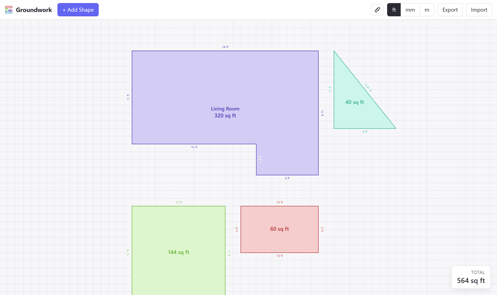

# Groundwork

**Sketch a floor plan, get the square footage.** Groundwork is a free,
browser-based tool for laying out rooms from simple shapes and reading off the
total area — no sign-up, no install, nothing leaves your computer.

### → [Open Groundwork](https://tristanmenzel.github.io/groundwork/)

## What you can do

- **Build rooms from shapes** — drop in rectangles, squares, and right-angle
  triangles, and size them to your space.
- **Snap things together** — drag shapes and their edges and corners magnetise
  to neighbours so your layout lines up cleanly.
- **Combine shapes into a room** — merge several shapes into one room. Overlaps
  are never double-counted, so the area and outline stay honest.
- **See every measurement** — each edge is labelled with its length, every
  shape shows its area, and the running **total square footage** sits in the
  bottom-right.
- **Measure as you go** — the ruler tool shows live distances from your cursor
  to the walls in every direction.
- **Work in your units** — switch between feet, millimetres, and metres at any
  time; nothing is lost in the conversion.
- **Keep your work** — layouts save automatically in your browser, and you can
  export/import them as a file to back up or share.

## Using Groundwork

- **Add a shape** — click **+ Add Shape**, pick triangle / square / rectangle,
  enter the dimensions, and add it. Double-click any shape to edit it.
- **Select** — click a shape, Ctrl-click to add or remove others, or drag a box
  across empty space to select everything inside it.
- **Move** — drag the area label in the middle of a shape. Arrow keys nudge the
  selection a little at a time; **Delete** removes it.
- **Make a room** — select two or more shapes and choose **Combine into Room**.
  Select a room and choose **Disband** to split it back into shapes.
- **Get around** — right-click (or middle-click, or hold space) and drag to pan;
  scroll to zoom.
- **Save / share** — use **Export** to download your plan as a file and
  **Import** to load it back.

## Running it yourself / contributing

Groundwork is open source and runs entirely in the browser. To build it
locally or contribute, see [CONTRIBUTING.md](CONTRIBUTING.md).

## License

[MIT](LICENSE)
